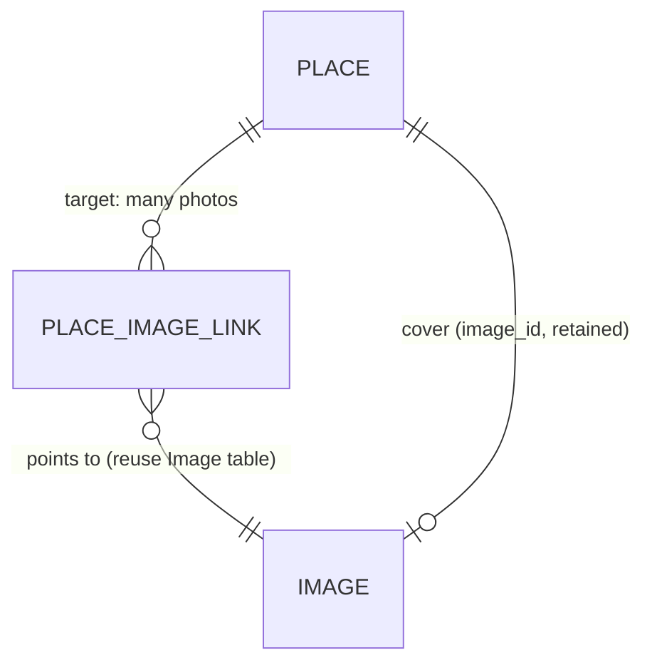
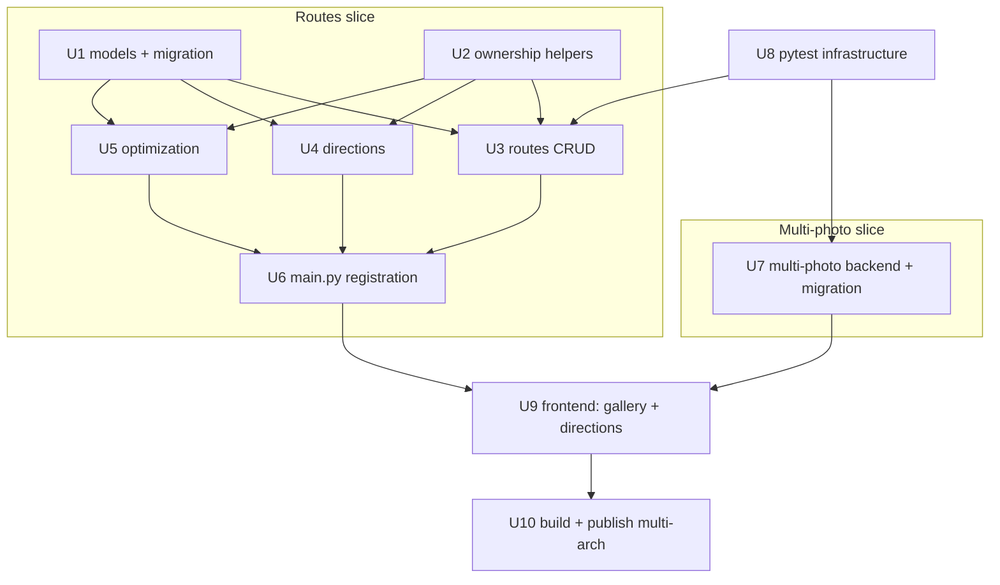

# Trip Fork: Transport Routes + Multi-Photo - Plan

## Goal Capsule

- **Objective:** Customize the `iSevenDays/trip` fork with two slices — transport routes (multi-stop Google Maps directions by place name + nearest-neighbor optimization) and multiple photos per place — then build and publish a multi-arch container image and hand back its digest so a separate deploy repo can consume it.
- **Product authority:** This plan owns the customized image end to end (both feature slices, the Alembic migrations, and the build/publish/hand-back). The deploy repo's digest repoint and `make trip-deploy` are context only — not active scope.
- **Execution profile:** Code. Two parallel backend/frontend slices against a frozen runtime contract, then a multi-arch container build and publish. The plan does not execute the build; it stops at the hand-back contract.
- **Stop conditions:** The plan is implementation-ready when both slices carry repo-relative file paths, KTDs, per-unit test scenarios, repo-level verification commands, and a digest-capture step. It does not run the build or push the image.
- **Tail ownership:** The deploy repo owns the digest repoint in `vars/trip.yml` and `make trip-deploy`. This plan hands back the image ref plus the branch/commit it was built from and stops.
- **Open blockers:** None. The one execution-time risk (PR #240 commit contents taken on the handover's characterization) is resolved during planning — see Dependencies / Assumptions.

---

## Product Contract

### Summary

A customized `iSevenDays/trip` image that adds transport routes and multiple photos per place, built as a multi-arch manifest and published to GHCR for the deploy repo to pin by digest. Routes and multi-photo ship together in one image; both are scoped slices of a larger, mostly-rejected upstream change.

### Problem Frame

The fork needs two capabilities upstream does not provide merged. Upstream PR #240 (candogruyol:feat/all-extensions) contains the transport-routes feature, but it is unmerged and bundles seven feature areas plus a TRIP → "TravelThing" rebrand — taking the whole PR pulls in six unwanted features and a rebrand. Upstream also allows only one photo per place. Separately, the deploy target (a Debian-13 amd64 LXC under rootful podman) needs an amd64 image, so an arm64-only build from Apple Silicon will not run there. This plan takes only the routes slice, adds multi-photo by reusing a pattern already in the codebase, and publishes a multi-arch image without disturbing the frozen runtime contract.

### Key Decisions

- **Routes slice only; reject the bundled features and rebrand.** `session-settled: user-directed` — chosen over taking the full PR #240 bundle: only transport routes + directions are wanted (upstream discussion #176). The extraction *mechanism* is settled in KTD1. Governs R1, R2, R4.
- **Multi-photo on Place by mirroring the existing multi-image pattern `TripItem` uses.** `session-settled: user-approved` — chosen over a new `place_photos` table or a JSON column: the codebase already has this many-to-many link pattern, so the existing single photo can become the cover with no new schema idiom. Governs R5, R6.
- **Rootful container; no non-root `USER` directive.** `session-settled: user-directed` — chosen over user-hardening: the container must write root-owned files to `/app/storage`; a non-root mismatch once caused a 500. Governs R7.
- **Multi-arch (amd64 + arm64) manifest.** `session-settled: user-directed` — chosen over an arm64-only build: the target LXC `lxc_trip` is amd64, and the existing pin references a multi-arch image-index digest. Governs R8.
- **Alembic for every schema change.** `session-settled: user-directed` — chosen over hand-editing the live database: migrations stay reproducible and versioned. Governs R5, R6.

### Requirements

**Transport routes**

- R1. The fork supports transport routes as first-class data — an `item_route` with its `route_option` children — created, read, updated, and deleted through the app, with the schema introduced via an Alembic migration.
- R2. A route produces a Google Maps multi-stop directions link built from stop **place names**, not raw coordinates.
- R3. A route can be optimized by a nearest-neighbor reordering of its stops.
- R4. Only the routes endpoints/routers are wired into the app; the restaurant, reservation, budget, and other bundled Phase-2 routers from PR #240 are not registered, and the app is not rebranded.

**Multiple photos per place**

- R5. A place supports multiple photos ordered by insertion (upload order), implemented by mirroring the many-to-many image-link pattern `TripItem` already uses; the place's current single photo is preserved and becomes the cover on migration. (User-driven reordering is out of scope — see OQ1.)
- R6. Multi-photo is reflected across every layer — model, an Alembic migration that backfills the existing single photo into the new structure, API (create/update accept a list), and frontend (multi-file upload with a gallery and a selectable cover).

*Target shape for R5. Mirrors `TripItemImageLink` (`backend/trip/models/models.py:798`). Retaining `image_id` as the cover keeps existing single-photo places displaying unchanged; the exact mechanism is fixed in KTD3.*

**Runtime and build contract**

- R7. The image preserves the existing runtime contract unchanged: the app listens on container port 8000, persistent storage is bind-mounted at `/app/storage`, the container runs as root with no non-root `USER` directive, and no `nofile` ulimit is raised above the runtime's 524288.
- R8. A multi-arch manifest spanning `linux/amd64` and `linux/arm64` is built and pushed to `ghcr.io/isevendays/trip:routes-photos`; the manifest must include an amd64 entry.
- R9. The `feat/routes-photos` branch is pushed to the fork as the source-of-truth the image is built from.

**Verification and hand-back**

- R10. The hand-back reports the full image ref with its multi-arch image-index digest, the routes extraction path actually taken (surgical port-and-adapt) with the skipped commits, and the fork branch plus commit SHA the image was built from.

### Key Flows

- F1. Build and view a route.
  - **Trigger:** A user has a trip with two or more items/places and wants driving directions.
  - **Actors:** End user; Google Maps (external).
  - **Steps:** Select the items/places to include → generate the multi-stop directions link from their place names → optionally run nearest-neighbor optimization to reorder stops → open the link.
  - **Covered by:** R1, R2, R3.
- F2. Manage place photos.
  - **Trigger:** A user adds or edits photos on a place.
  - **Actors:** End user.
  - **Steps:** Upload one or more photos → photos persist against the place → gallery displays them (in upload order) with one selected as cover → change the cover → delete a photo.
  - **Covered by:** R5, R6.

### Acceptance Examples

- AE1. **Multiple photos persist and display.** Given a place, when the user uploads two or more photos, then all photos persist across a page reload, display as a gallery, and one is marked as the cover. **Covers R5, R6.**
- AE2. **Legacy single photo is preserved.** Given an existing place that already has one photo, after the migration runs the photo is still present and shown as the cover, with no manual re-upload. **Covers R5.**
- AE3. **Route builds and optimizes.** Given a trip with two or more items/places, when the user builds a route, then a Google Maps multi-stop directions link keyed on place names is produced, and nearest-neighbor optimization reorders the stops. **Covers R1, R2, R3.**
- AE4. **Bundled features and rebrand stay out.** After the build, the restaurant, reservation, and budget endpoints are absent, and the application has not been rebranded to "TravelThing". **Covers R4.**

### Success Criteria

- The app boots and responds on container port 8000.
- The container runs as root and writes to `/app/storage` with no permission errors.
- The pushed manifest includes an amd64 entry that runs on the `lxc_trip` host.
- The digest handed back is the multi-arch image-index digest (not a single-arch digest).
- Existing places, photos, and trips survive the new migrations unchanged.

### Scope Boundaries

**Outside this work's identity**

- The other six PR #240 feature areas (restaurants, reservations, budget, calendar export, cost settlement, and the rest) — no routers, no UI, no tables.
- The TRIP → "TravelThing" rebrand (PR #240 commit `e0fc74f` is skipped); the existing fork `Dockerfile` is kept as-is, not the PR's Dockerfile switch (`51dd3d4`).
- The deploy repo's work — setting the digest in `vars/trip.yml` (`trip_image`) and running `make trip-deploy`.
- The per-place Google Maps *search* link (PR #240 `256bb3d`) — independent of the multi-stop directions button; deferred as optional polish.

**No dormant tables ship.** Unlike a raw cherry-pick of the PR's bundled migration, the surgical extraction creates only `item_route` and `route_option`. The restaurant, budget, flight, and other Phase-2 tables are not created. (See KTD1.)

### Dependencies / Assumptions

- **Resolved during planning:** PR #240 was fetched as local ref `pr240` and its commits inspected. All cited SHAs exist; the routes slice is concentrated in `d3b4aab` (models), `e11ea2f` (bundled migration, rewritten — see KTD2), `d30bcef`/`4e618d6` (routes CRUD), `7010833` (directions), `1339de7` (place-names URL), `603ac53` (optimization, extracted). Current Alembic head is `a3f1c9d47b02` (git HEAD `6bb2eb2`); the PR's migration chain does not exist on main, confirming the rewrite. Skip the rebrand `e0fc74f` and the Docker switch `51dd3d4`.
- The `upstream` remote and the `feat/routes-photos` branch do not yet exist in the checkout; both are created at execution. `git fetch upstream refs/pull/240/head:pr240` is the source ref.
- Google Maps directions need **no** API key: U4 builds the directions URL from stop place names only (no server-side Google call). A user Google API key (`user.google_apikey`) is unrelated to this feature — do not imply directions require one.
- The GHCR push requires a GitHub PAT with `write:packages` for the `iSevenDays` fork (`GHCR_TOKEN`).
- The app auto-runs `alembic upgrade head` on every boot via `init_and_migrate_db` (`backend/trip/db/core.py`), so a new migration file applies on the next container start with no manual step.
- The `conftest.py` from PR #240 `5c1d79e` was authored against older models and may need added required fields for current `Trip` / `Place` / `TripItem`; verify with `pytest tests/test_smoke.py` (see U8).
- **Verified against the codebase:** stack is FastAPI + SQLModel + Alembic + Angular + SQLite; `Place` is single-image today (`backend/trip/models/models.py:513`); `TripItem` already has a multi-image many-to-many pattern via `TripItemImageLink` (`backend/trip/models/models.py:798`, `:848`) with `_resolve_item_images` / `_cover_image_id` helpers in `backend/trip/routers/trips.py:400-431`; the generic `Image` table exists (`backend/trip/models/models.py:227`); the `Dockerfile` exposes 8000 and has no `USER` directive; routers take effect only via the `import` tuple + `app.include_router(...)` list in `backend/trip/main.py:13-14,47-54`; host `docker` reports `linux/amd64` with `buildx v0.35.0` (native amd64 builds, arm64 via emulation).

### Sources / Research

- Upstream PR #240 (`candogruyol:feat/all-extensions`, unmerged, merge-base `863dcc4`) and discussion #176 — the routes slice origin.
- PR #240 commit roles (ref `pr240`): `d3b4aab` defines `ItemRoute` + `RouteOption` verbatim alongside 7 unwanted models; `e11ea2f` creates 9 tables in one migration chained off `da76d4a0eaec` (absent on main); `d30bcef` + `4e618d6` add the routes CRUD router (`backend/trip/routers/item_routes.py`, prefix `/api/trips`, tags `["routes"]`); `7010833` + `1339de7` add the directions router with a place-names `_build_url`; `603ac53` adds the optimize endpoint (haversine nearest-neighbor) inside a bundled `exports.py`; `5c1d79e` adds the pytest infrastructure; `e0fc74f` rebrand and `51dd3d4` Docker switch — both skipped.
- `backend/trip/models/models.py` — `Image` (`:227`), `Place` single `image_id` (`:513`), `TripItemImageLink` (`:798`), `TripItem.images` (`:848`), `TripItemCreate.images` + `cover_index` (`:859`–`:860`), `ItemImageInput` (`:851`), the `Image` `after_delete` / `Session` `after_commit` file-cleanup listeners (`:246-253`, `:27-32`).
- `backend/trip/routers/trips.py` — `_resolve_item_images` (`:400-424`), `_cover_image_id` (`:427-431`), create (`:490-506`), update (`:579-608`), delete (`:631-639`) image flows to mirror.
- `backend/trip/routers/places.py` — current single-image API (create `:51-72`, update `:96-133`, delete `:156-163`).
- `backend/trip/db/migrations.py` — `_006_backfill_tripitem_images` (`:119-135`) is the backfill precedent; `_ONCE_MIGRATIONS` (`:157-160`) registers one-shot data migrations.
- `backend/trip/db/core.py` — `init_and_migrate_db` (`:44-63`) auto-runs `alembic upgrade head` on boot.
- `src/src/app/modals/trip-create-day-item-modal/` — `EditImage`, `images`/`coverIndex` signals, `onImagesSelected`, `setCover`, `removeImage`, gallery grid markup — the frontend pattern to mirror.
- `src/src/app/shared/item-gallery/item-gallery.component.ts` — standalone read-only gallery widget reusable for Place with no changes.
- `git remote`: `origin` = `git@github.com:iSevenDays/trip.git` (fork owner `iSevenDays`).

---

## Planning Contract

### Key Technical Decisions

- KTD1. **Surgical port-and-adapt for the routes slice, not a raw cherry-pick.** `session-settled: user-approved — the brainstorm's path-(a)-or-(b) contingency; research confirmed the conflicts are material.` The PR's migration chain (`bfbce549e783` → `da76d4a0eaec` → `fd393ab4c012`) does not exist on main, and its table migration creates 9 tables at once. Instead: extract only `ItemRoute` + `RouteOption` into a fresh `extensions.py`, write one fresh migration (KTD2), and take the tip-of-PR router files verbatim (new files, zero conflict). Ships zero dormant Phase-2 tables. Governs R1, R2, R3, R4.
- KTD2. **Fresh Alembic revision chained off the current head `a3f1c9d47b02`.** The PR's `down_revision` values are rewritten to the current head so the chain stays single-headed. Confirm with `alembic heads` at execution time (the head may have shifted since planning). Two tables only: `item_route`, `route_option`. Governs R1.
- KTD3. **Multi-photo mirrors `TripItemImageLink`; retain `image_id` as the cover and accept `cover_index` in the DTO.** `TripItem` already stores both a denormalized `image_id` cover pointer and an M2M `images` gallery, with `cover_index` as a write-time DTO field only. `Place` mirrors this exactly: new `PlaceImageLink` + `Place.images`, existing `image_id`/`image` kept as the cover, `PlaceCreate` / `PlaceUpdate` accept `list[ItemImageInput]` + `cover_index`. Reuses the `_resolve_item_images` / `_cover_image_id` helpers and the `Image` `after_delete` file cleanup unchanged. Governs R5, R6.
- KTD4. **Dormant Phase-2 routers suppressed by omitting registration in `main.py`.** A router file on disk with no entry in the `import` tuple (`backend/trip/main.py:13-14`) and no `app.include_router(...)` call (`:47-54`) is inert — no flag, no settings gate. Only `directions`, `item_routes`, and the optimize router are registered. Governs R4.
- KTD5. **Multi-arch build via `buildx`; hand back the image-index digest, not a tag or a per-arch digest.** `docker buildx build --platform linux/amd64,linux/arm64 --push`; capture the top-level manifest digest with `docker buildx imagetools inspect ghcr.io/isevendays/trip:routes-photos`. The deploy repo pins by this index digest so both architectures resolve. arm64 builds run under QEMU emulation (slow but functional); the host is native amd64. Governs R8.

### Implementation constraints

- **Frozen runtime contract (R7):** the `Dockerfile` keeps `EXPOSE 8000`, keeps the bind-mount target `/app/storage`, adds no non-root `USER` directive, and does not raise `nofile` above the runtime's 524288. The image is built from the existing two-stage `Dockerfile` unchanged.
- **Alembic only (R5, R6):** every schema change is a versioned migration; the live database is never hand-edited. The boot auto-migrator applies new revisions on container start.
- **No rebrand, no bundled endpoints (R4):** the string "TravelThing" does not appear; `restaurants`, `reservations`, `budget`, `item_details`, `place_details`, `weather`, `versions`, `travel_info`, `token` routers are not registered.

### High-Level Technical Design

Two independent slices converge on one build. The routes slice ports upstream code; the multi-photo slice mirrors an in-repo pattern. Both add one Alembic revision, **serialized onto a single head** — U1's revision is created first (chained off the current head `a3f1c9d47b02`), then U7's revision chains off U1's revision, so the branch never has two heads. (Generating both off `a3f1c9d47b02` in parallel would fork the head, and the boot auto-migrator `init_and_migrate_db` runs `alembic upgrade head` on every start and crashes on a split head.) Tests land with each backend unit against a shared pytest backbone (U8). The frontend ports two Angular edits. The tail builds and publishes the multi-arch image.

*U8 feeds every test-bearing unit (two representative edges shown). U9 is one unit carrying both Angular edits — the place gallery (depends on U7) and the directions button (depends on U6). The two slices' code is independent and can be developed in parallel, but their two Alembic revisions are serialized onto one head (U1's first, U7's chained off it). Both converge on U10.*

---

## Implementation Units

| U-ID | Title | Key files | Depends on |
|---|---|---|---|
| U1 | Routes data model + migration | `backend/trip/models/extensions.py`, `backend/trip/alembic/env.py`, new alembic version | — |
| U2 | Routes ownership helpers | `backend/trip/routers/_helpers.py` | — |
| U3 | Routes CRUD router + tests | `backend/trip/routers/item_routes.py`, `backend/tests/test_routes.py` | U1, U2, U8 |
| U4 | Directions router + tests | `backend/trip/routers/directions.py`, `backend/tests/test_directions.py` | U2, U8 |
| U5 | Optimization router + tests | `backend/trip/routers/optimization.py`, `backend/tests/test_optimize.py` | U2, U8 |
| U6 | Router registration | `backend/trip/main.py` | U3, U4, U5 |
| U7 | Multi-photo backend + tests | `backend/trip/models/models.py`, `backend/trip/routers/places.py`, new alembic version, `backend/trip/db/migrations.py`, `backend/tests/test_places_photos.py` | U8 |
| U8 | pytest infrastructure | `backend/tests/conftest.py`, `backend/tests/test_smoke.py`, `backend/tests/__init__.py` | — |
| U9 | Frontend: gallery + directions + optimize | `src/src/app/modals/place-create-modal/*`, `src/src/app/components/trip/trip.component.*`, `src/src/app/services/api.service.ts` | U6, U7 |
| U10 | Build, publish, hand back | `Dockerfile` (unchanged), build/push commands, hand-back report | U1–U9 |

### U1. Routes data model + migration

- **Goal:** Introduce `ItemRoute` and `RouteOption` as SQLModel tables and the migration that creates them, so the routes routers can persist data.
- **Requirements:** R1.
- **Files:** `backend/trip/models/extensions.py` (new), `backend/trip/alembic/env.py` (add `from trip.models.extensions import *  # noqa`), `backend/trip/alembic/versions/<new>_add_item_route_and_route_option.py` (new).
- **Approach:** Create `extensions.py` with only `ItemRoute` (table `item_route`: `id`, `from_item_id`→`tripitem.id`, `to_item_id`→`tripitem.id`, `day_id`→`tripday.id`, all indexed with `ondelete="CASCADE"`; `recommended_mode`, `notes`; `from_item`/`to_item`/`day` relationships) and `RouteOption` (table `route_option`: `id`, `route_id`→`item_route.id` indexed CASCADE; `mode`, `duration_minutes`, `distance_km`, `cost`, `line_name`, `notes`, `recommended`). Import `from .models import TripDay, TripItem`. Do not port the other seven Phase-2 models. Then `cd backend && alembic revision --autogenerate -m "add item_route and route_option"` and set `down_revision` to the current head (`a3f1c9d47b02`; confirm with `alembic heads`). Source for the class bodies: PR #240 `d3b4aab`.
- **Test Scenarios:**
  - Migration creates both tables on a fresh DB; columns, FKs, and indexes match the model.
  - `alembic downgrade` drops both tables cleanly; `alembic upgrade head` restores them.
  - `alembic heads` reports exactly one head after the revision lands.
- **Verification:** `cd backend && alembic upgrade head` then `alembic heads` (one head); `python -c "from trip.models.extensions import ItemRoute, RouteOption"`.

### U2. Routes ownership helpers

- **Goal:** Provide the shared trip/day/item ownership verifiers the routes routers depend on.
- **Requirements:** Supports R1, R2, R3.
- **Files:** `backend/trip/routers/_helpers.py` (new).
- **Approach:** Port **three** of the four helpers from the PR #240 `4e618d6` refactor: `verify_trip_ownership`, `verify_day_in_trip`, `verify_item_in_trip`. (Drop `verify_place_ownership` — the routes routers never call it, and U7's places rewrite does not switch to it either, so porting it would ship dead code.) Each loads the parent (via `Trip.user` or `TripMember`), raises `HTTPException(404)` when absent or not owned, and returns the verified object. All required model attributes (`Trip.user`, `TripMember.user`/`joined_at`/`trip_id`, `TripDay.trip_id`, `TripItem.day_id`) exist on main.
- **Test Scenarios:**
  - Owner of a trip/day/item passes; a different user gets 404.
  - A non-existent id gets 404 (not 500).
- **Verification:** exercised through U3/U4/U5 tests.

### U3. Routes CRUD router + tests

- **Goal:** Expose create/read/**update**/delete for routes and their route options under `/api/trips` (R1 requires update).
- **Requirements:** R1.
- **Files:** `backend/trip/routers/item_routes.py` (new), `backend/tests/test_routes.py` (new).
- **Approach:** Take the **tip-of-PR** `item_routes.py` as the base (post-`4e618d6`, ~227 lines): `router = APIRouter(prefix="/api/trips", tags=["routes"])`, inline schemas `RouteCreate`, `RouteRead`, `RouteReadWithOptions`, `RouteOptionCreate`, `RouteOptionRead`, with `ROUTE_MODES = Literal["walk","tram","bus","taxi","metro","car","ferry","bike"]` on `RouteOptionCreate.mode`. Then **add the update endpoints R1 requires that the PR omits** (the tip-of-PR file has only create/read/delete): `PATCH /{trip_id}/routes/{route_id}` and `PATCH /{trip_id}/routes/{route_id}/options/{option_id}`, each guarded by the U2 ownership helpers. Final endpoint set: `POST/GET/GET/{id}/PATCH/{id}/DELETE /{trip_id}/routes` and `POST/GET/PATCH/DELETE /{trip_id}/routes/{route_id}/options`. Take the matching `test_routes.py` (fixtures `second_item`, `_create_route`; 8 test classes) and extend it with an update class (see Test Scenarios). Source: PR #240 `d30bcef` + `4e618d6`.
- **Test Scenarios:**
  - Create a route between two items in the same day; read it back with options.
  - Create/list/delete a route option; `mode` outside `ROUTE_MODES` is rejected with 422.
  - Cascade: deleting a route drops its options; deleting an item drops routes referencing it.
  - Update: `PATCH` on a route changes `recommended_mode`/`notes`; `PATCH` on an option updates `mode`/`duration_minutes`/`distance_km`; an out-of-range `mode` is rejected with 422; an unchanged route read-back matches.
  - Auth: a foreign user gets 404 on every route and option endpoint (including PATCH).
- **Verification:** `cd backend && pytest tests/test_routes.py -q`.

### U4. Directions router + tests

- **Goal:** Produce a Google Maps multi-stop directions URL from a day's or trip's items, keyed on place names.
- **Requirements:** R2.
- **Files:** `backend/trip/routers/directions.py` (new), `backend/tests/test_directions.py` (new).
- **Approach:** Take the **tip-of-PR** `directions.py` as the base: `router = APIRouter(prefix="/api/trips", tags=["directions"])`, `GET /{trip_id}/days/{day_id}/directions` and `GET /{trip_id}/directions`. `_build_url` uses `urllib.parse.quote(s.name, safe="")` joined by `/` under `https://www.google.com/maps/dir/` (the `1339de7` place-names form). Stop selection sorts items by `item.time` and includes every item whose place has a non-empty **name**, regardless of whether coordinates are present — R2 keys the URL on place names, so coordinates are not a gate. **Drop the PR's "skip items without coords" clause** (it contradicts R2 and silently drops named stops). Take the matching `test_directions.py` (3 classes) and extend it with a named-but-no-coords case (see Test Scenarios). **Add an optional `order` query param** (comma-separated item ids) to both directions endpoints; when present, `_build_url` builds the URL from exactly those items in the given order, bypassing the time-sort — this lets the optimization result (U5/U9) drive the directions link. Source: PR #240 `7010833` + `1339de7`.
- **Test Scenarios:**
  - A day with 3 ordered places yields a URL containing all three names, URL-encoded, in time order.
  - Items without a place are omitted; an item whose place has a name but no coordinates is **included** (the URL is keyed on names, not coords).
  - With `?order=<item_ids>`, the URL follows that exact order (used by the optimize flow), ignoring `item.time`.
  - An empty day yields an empty `google_maps_url` and `stop_count: 0`.
  - Auth: a foreign user gets 404.
- **Verification:** `cd backend && pytest tests/test_directions.py -q`.

### U5. Optimization router + tests

- **Goal:** Reorder a day's stops by nearest-neighbor and report the distance saved.
- **Requirements:** R3.
- **Files:** `backend/trip/routers/optimization.py` (new), `backend/tests/test_optimize.py` (new).
- **Approach:** Extract only the optimization section from PR #240 `603ac53` into a dedicated `optimization.py` (not the misleading `exports.py` name): `router = APIRouter(prefix="/api/trips", tags=["optimization"])`, `POST /{trip_id}/days/{day_id}/optimize`. Port `haversine(lat1,lng1,lat2,lng2)` and `_total_distance(points)` verbatim, the `OptimizePointRead` and `OptimizeResponse` schemas, and the `optimize_route` endpoint (nearest-neighbor starting at `points[0]`, returns `original_order`, `optimized_order`, `original_distance_km`, `optimized_distance_km`, `savings_km`). Drop the iCal and cost-settlement sections and the `Response`/`fastapi.responses` import they need. Port only the `TestRouteOptimization` class.
- **Test Scenarios:**
  - A day with 4+ geo-located items returns an `optimized_order` that is a valid permutation of the input (same length, same elements) produced by the greedy nearest-neighbor walk from `points[0]`; assert the permutation is correct and that `savings_km == original_distance_km - optimized_distance_km` (signed). Do **not** assert `optimized_distance_km <= original_distance_km` — nearest-neighbor from a fixed start is a heuristic and can return a longer order than the input on already-short sequences.
  - Items without coords are excluded; a single-item day returns identical orders and zero savings.
  - Auth: a foreign user gets 404.
- **Verification:** `cd backend && pytest tests/test_optimize.py -q`.

### U6. Router registration

- **Goal:** Wire the three new routers into the app without registering any Phase-2 router.
- **Requirements:** R4.
- **Files:** `backend/trip/main.py`.
- **Approach:** Add `directions`, `item_routes`, and `optimization` to the existing router import tuple (`backend/trip/main.py:13-14`) and append three `app.include_router(...)` calls (`:47-54`). This is the single guaranteed-conflict file (the PR's import tuple differs entirely) but the edit is trivial: insert into the existing tuple and list, change nothing else. Do not alter `allow_credentials` (main has `False`; the PR has `True` — leave main as-is).
- **Test Scenarios:**
  - After registration, `GET /api/trips/{id}/routes` and the directions/optimize endpoints respond; `GET /api/trips/{id}/restaurants` (and other Phase-2 paths) return 404.
  - The app boots with no import errors.
- **Verification:** `cd backend && python -c "from trip.main import app; print([r.path for r in app.routes])"` shows the routes and omits Phase-2 paths.

### U7. Multi-photo backend + tests

- **Goal:** Let a place hold multiple ordered photos with a selectable cover, preserving the legacy single photo as the cover on migration.
- **Requirements:** R5, R6.
- **Files:** `backend/trip/models/models.py`, `backend/trip/routers/places.py`, new alembic version, `backend/trip/db/migrations.py`, `backend/tests/test_places_photos.py` (new).
- **Approach:** Mirror `TripItem` exactly (KTD3). Add `PlaceImageLink(SQLModel, table=True)` next to `TripItemImageLink` (`models.py:798`) with `place_id`/`image_id` composite PK, both `ondelete="CASCADE"`. Add `images: list[Image] = Relationship(link_model=PlaceImageLink)` to `Place`; keep the existing `image_id`/`image` pair as the cover. Change `PlaceCreate.image: str | None` → `images: list[ItemImageInput] = []` + `cover_index: int | None = None`; **`PlaceUpdate` uses `images: list[ItemImageInput] | None = None` + `cover_index: int | None = None`** — KTD3 says both DTOs accept `cover_index`, and the frontend sends it on edit, so omitting it from `PlaceUpdate` would silently reset the cover on save. Add `images: list[ImageRead]` to `PlaceRead` and serialize it.

  **Preserve image-by-URL (do not drop it).** Today `places.py` fetches a remote image when `image[:4] == "http"`; the bare mirror has no URL path, and Pydantic would silently drop the renamed key (so the MCP server's `image_url` would report success while storing nothing). Add an optional `url: str | None = None` to `ItemImageInput` and extend `_resolve_item_images` to fetch+save a URL image (reuse the existing `download_file` helper) when `url` is set; update the MCP server's place-create call to send `images=[{"url": ...}]` instead of the legacy `{"image": ...}`. If sunset is intended instead, state it explicitly in Scope Boundaries — do not let it break silently.

  **Server-side upload limits (R5).** Enforce bounds on the multi-photo payload: a `max_length` on `PlaceCreate.images` (count cap), a per-entry base64-payload size cap, and `Image.MAX_IMAGE_PIXELS` set in `backend/trip/utils/utils.py` so decompression-bomb / oversized images are rejected rather than decoded in-request. These guards apply to every image endpoint, not just places.

  **Ownership of reused image ids (prevent IDOR).** In `_resolve_item_images`, validate that every reused `id` belongs to the current user before linking it, so a caller cannot attach or replace another user's image by referencing its id.

  In `places.py`, import (or share) `_resolve_item_images` / `_cover_image_id` from `trips.py`, rewrite `create_place` / `update_place` / `delete_place` to mirror the item flows, and add `selectinload(Place.images)` to the read endpoints. Gallery uploads call `save_image_to_file(bytes, PLACE_IMAGE_SIZE)` to keep them downscaled — passing `0` would store multi-MB originals verbatim and bloat storage; use a long-edge resize if preserving aspect ratio matters.

  **Migration (R6 — backfill inside Alembic, not a boot hook).** `cd backend && alembic revision --autogenerate -m "place multi-image gallery"`; set its `down_revision` to **U1's new revision** (the routes migration — see High-Level Design), not the original head, so the chain stays single-headed. Inside that revision's `upgrade()`, after creating `place_image_link`, run a data backfill that walks every `Place` with an `image_id` and inserts a `PlaceImageLink` row pointing at it (mirror the `_006_backfill_tripitem_images` logic at `db/migrations.py:119`). Do **not** register this backfill as a `_ONCE_MIGRATIONS` boot hook — R6 requires the backfill to be part of the Alembic migration so `alembic upgrade head` alone leaves legacy places covered (a boot hook is invisible to the verification command). The existing `Image` `after_delete` / `after_commit` listeners handle file cleanup with no extra code.
- **Test Scenarios:**
  - Create a place with two uploaded photos; both persist, the first is the cover (`image_id` points at `images[0]`).
  - Update with a new list including one reused id and one new upload; dropped photos' files are removed from `ASSETS_FOLDER`.
  - `cover_index` selects a non-zero cover; an out-of-range index falls back to 0.
  - URL image: a place created with `images=[{"url": "<remote>"}]` fetches and stores the remote image (the legacy image-by-URL feature is preserved, not dropped).
  - Auth/IDOR: a user cannot attach, replace, or delete another user's image by reusing its id (404); a foreign user gets 404 on the place photo endpoints.
  - Upload limits: an over-count or oversize payload (incl. a decompression-bomb PNG) is rejected with 4xx, not stored.
  - Legacy backfill: a pre-existing place with only `image_id` gains one `PlaceImageLink` row after `alembic upgrade head` (the backfill runs inside the revision); `PlaceRead.images` has length 1.
  - Delete a place cascades to its `Image` rows and unlinks files.
- **Verification:** `cd backend && pytest tests/test_places_photos.py -q`; `alembic upgrade head` on a DB seeded with a single-photo place leaves it visible as the cover.

### U8. pytest infrastructure

- **Goal:** Establish the in-memory SQLite + `TestClient` backbone every backend test unit depends on.
- **Requirements:** Supports U3–U7.
- **Files:** `backend/tests/__init__.py` (new, empty), `backend/tests/conftest.py` (new), `backend/tests/test_smoke.py` (new).
- **Approach:** Port PR #240 `5c1d79e` verbatim: `StaticPool` in-memory SQLite, `TestClient` with the `get_session` dependency override, and the `db`, `client`, `test_user`, `test_category`, `test_place`, `test_trip_with_item` fixtures. The fork has no `backend/tests/` today, so there is no textual conflict. Reconcile any model drift: the conftest was authored against older models, so add any now-required fields on `Trip` / `Place` / `TripItem` (e.g. non-nullable columns added since `863dcc4`) so the fixtures construct valid objects.
- **Test Scenarios:**
  - `test_smoke.py` constructs each fixture and asserts it is truthy (the fixtures themselves are the thing under test).
- **Verification:** `cd backend && pytest tests/test_smoke.py -q` passes before U3–U7 tests are added.

### U9. Frontend: place gallery + directions + optimize

- **Goal:** Replace the single-image Place editor with a multi-file gallery, add a per-day Google Maps directions button, and add a per-day optimize button that reorders stops by nearest-neighbor and feeds the optimized order into the directions link.
- **Requirements:** R6, R3; supports F1.
- **Files:** `src/src/app/modals/place-create-modal/place-create-modal.component.{ts,html}`, `src/src/app/components/trip/trip.component.{ts,html}`, `src/src/app/services/api.service.ts`, `src/src/app/types/trip.ts` (a `PlaceImage` type if not reused).
- **Approach:** Port the item-modal gallery surface into the place modal: `EditImage`, `images = signal<EditImage[]>([])`, `coverIndex = signal(0)`, `onImagesSelected` (multi-file DataURL append, **with per-file error handling**: reject non-image / oversize files, surface a per-file toast on `FileReader` error, and show an N-of-M partial-success message so a dropped photo is never invisible), `setCover`, `removeImage`, and the `closeDialog` payload that maps each `EditImage` to `{id}` or `{data}` plus `cover_index`. Replace the single-image widget at `place-create-modal.component.html:56-87` with the gallery grid + cover star + remove button from `trip-create-day-item-modal.component.html:163-199` and a multi-file `<input type="file" accept="image/*" multiple>`. Render existing place galleries by reusing `app-item-gallery` (`src/src/app/shared/item-gallery/`) with `[images]="place.images"` `[coverId]="place.image_id"` — no changes to that component if `PlaceRead.images` matches `{id,url}[]`. Separately, port the directions-only hunks from PR #240 `cfd3a99`: add `dayDirectionsMap` + `openDayDirections` to `trip.component.ts`, `getDayDirections(tripId, dayId)` to `api.service.ts`, and the `<p-button icon="pi pi-directions">` blocks to `trip.component.html`. **Button rule (avoid a duplicate):** main already has a `tripDayToNavigation` button that *also* uses `pi pi-directions` but builds a coords-based URL (`trip.component.html:1106`); the new by-name button **replaces** `tripDayToNavigation` — delete the old handler and its markup so there is exactly one directions button, keyed on place names (R2), not two identical buttons. **Sub-2-stops state:** when a day has fewer than two place-stops, disable the button and toast `routing.not_enough_values`, matching the existing `dayRouting` convention (`trip.component.ts:3119`). **Optimization UI (R3, end-to-end):** add an "Optimize route" button per day that mirrors the directions button — `optimizeDay(tripId, dayId)` in `api.service.ts` (same shape as `getDayDirections`), a handler in `trip.component.ts` that calls it and stores `optimized_order` + `savings_km` in a signal, and markup showing the suggested order and savings. Add an "Open optimized directions" action that calls `getDayDirections(tripId, dayId, { order: optimizedItemIds })` (the U4 `order` param) and opens the returned URL, so the optimization result drives the directions link instead of sitting unused. The optimize endpoint and nearest-neighbor algorithm are ported verbatim in U5 — this unit only adds the frontend caller. Skip the weather badge and the optional place-box search link. Main's `trip.component.{html,ts}` has diverged (multi-image, GPX, OIDC), so re-apply hunks by hand against current code — do not cherry-pick.
- **Test Scenarios:**
  - Uploading 3 photos shows 3 thumbnails with the first starred; removing the starred photo re-points the cover to index 0.
  - Saving and reopening the place modal shows the persisted gallery and cover.
  - The directions button opens the Google Maps URL for the day's places in a new tab.
  - The directions button is disabled with a `routing.not_enough_values` toast on days with fewer than two place-stops.
  - The "Optimize route" button returns a reordered stop list and a `savings_km` figure; "Open optimized directions" opens a URL whose stops follow the optimized order (fewer-than-two-stops behaves like the directions button).
  - Multi-file upload with one bad file (non-image or oversize) shows a per-file error and keeps the valid files (partial success, no silent drop).
  - `npm run build` compiles with no type errors.
- **Verification:** `cd src && npm run build`; manual smoke against the running container.

### U10. Build, publish, and hand back

- **Goal:** Produce the multi-arch image, push it to GHCR, and report the image-index digest with provenance.
- **Requirements:** R7, R8, R9, R10.
- **Files:** `Dockerfile` (unchanged — verify it still matches R7), build/push commands, hand-back report.
- **Approach:** Commit all units on `feat/routes-photos` and push the branch to `origin` (R9). **Authenticate to GHCR before pushing** (the `write:packages` PAT in `GHCR_TOKEN`): `printf '%s' "$GHCR_TOKEN" | docker login ghcr.io -u iSevenDays --password-stdin` — read the token from stdin, never as a CLI argument (it would leak via shell history / `ps`) and never baked into an image layer; ensure CI/logs mask it. Build and push the multi-arch manifest: `docker buildx build --platform linux/amd64,linux/arm64 -t ghcr.io/isevendays/trip:routes-photos --push .` (R8). The `Dockerfile` is the existing two-stage file — do not add a `USER` directive, do not raise `nofile`, keep `EXPOSE 8000` and the `/app/storage` expectation (R7). Capture the digest: `docker buildx imagetools inspect ghcr.io/isevendays/trip:routes-photos` — record the top-level image-index `sha256:`, not a per-arch digest (KTD5). Smoke the amd64 image locally before declaring done.
- **Test Scenarios:**
  - Local amd64 run: `docker run --rm -p 8080:8000 -v "$PWD/storage:/app/storage" ghcr.io/isevendays/trip:routes-photos` boots, responds on :8080, writes root-owned files to `/app/storage`, logs no permission errors.
  - `imagetools inspect` lists both `linux/amd64` and `linux/arm64` manifests under one index digest.
- **Verification:** the hand-back ref `ghcr.io/isevendays/trip@sha256:<index-digest>` plus the branch and commit SHA; confirm the amd64 entry pulls on the `lxc_trip` host architecture.

---

## Verification Contract

| Check | Command | Proves |
|---|---|---|
| Migration chain | `cd backend && alembic upgrade head && alembic heads` | Exactly one Alembic head |
| Table scope | `sqlite3 backend/storage/trip.sqlite ".tables"` (after `alembic upgrade head` on a fresh DB) | New tables are exactly `item_route`, `route_option`, `place_image_link`; no dormant Phase-2 tables (restaurants / reservations / budget / flight / …). `alembic heads` alone does not inspect tables — this check does. |
| Backend routes tests | `cd backend && pytest tests/test_routes.py -q` | R1 (CRUD + cascade + auth) |
| Backend directions tests | `cd backend && pytest tests/test_directions.py -q` | R2 (place-names URL, ordering, skip-no-coords) |
| Backend optimization tests | `cd backend && pytest tests/test_optimize.py -q` | R3 (nearest-neighbor, distance savings) |
| Backend multi-photo tests | `cd backend && pytest tests/test_places_photos.py -q` | R5, R6 (create/update/cover/backfill/cascade) |
| Full backend suite | `cd backend && pytest -q` | Nothing regressed; smoke fixtures valid |
| Phase-2 routers absent | `cd backend && python -c "from trip.main import app; print([r.path for r in app.routes])"` | R4 (no restaurants/reservations/budget/etc.) |
| Frontend build | `cd src && npm run build` | U9 compiles with no type errors |
| Local amd64 run | `docker run --rm -p 8080:8000 -v "$PWD/storage:/app/storage" <image>` | R7 (boots on :8000, root writes, no permission errors) |
| Multi-arch publish | `docker buildx build --platform linux/amd64,linux/arm64 -t ghcr.io/isevendays/trip:routes-photos --push .` | R8 (both architectures under one manifest) |
| Digest capture | `docker buildx imagetools inspect ghcr.io/isevendays/trip:routes-photos` | R10 (record the image-index `sha256:`, not a per-arch digest) |

`release:validate` applies to U10: the manifest must show both architectures and the captured digest must be the index digest before the hand-back is reported.

---

## Definition of Done

**Global**

- `feat/routes-photos` is pushed to `origin` (`iSevenDays/trip`) with the build commit at its tip.
- `alembic upgrade head` succeeds on a fresh DB and on an existing DB seeded with a legacy single-photo place (the backfill runs and the photo survives as the cover).
- `alembic heads` reports exactly one head; the Table-scope check (Verification Contract) confirms the only new tables are `item_route`, `route_option`, and `place_image_link` — no dormant Phase-2 tables. (`alembic heads` alone does not inspect table names.)
- The multi-arch manifest is pushed with both `linux/amd64` and `linux/arm64` entries.
- The image-index digest is captured and reported as `ghcr.io/isevendays/trip@sha256:<index-digest>`.
- The container runs as root, writes to `/app/storage` with no permission errors, and the app responds on container port 8000.
- No experimental or dead-end code remains in the diff (the skipped PR #240 sections — iCal, cost settlement, restaurants, reservations, budget, weather, rebrand — are not present).
- The string "TravelThing" does not appear; `restaurants`/`reservations`/`budget` endpoints return 404.

**Per unit**

- Each unit's Verification command passes; every Test Scenario in U1–U9 is green, and U10's smoke + digest checks pass.

**Hand-back (R10)**

- The full image ref with image-index digest, the extraction path taken (surgical port-and-adapt; skipped commits listed in Scope Boundaries), and the fork branch plus build commit SHA.

---

## Open Questions

*Surfaced by ce-doc-review. These are genuine product/scope tradeoffs the review could not settle on its own; each names what it blocks so a decision can unblock implementation.*

### OQ1. Does multi-photo need reorderable / defined ordering?

> ✅ **Resolved (2026-08-12): Drop reorder.** Keep the mirror-`TripItem` decision (KTD3) as-is; gallery order is insertion/upload order. R5 and F2 have been updated to remove "reorder" / "defined order" wording. No position column, no reorder API/UI.

F2 lists "reorder" as a step and R5 says photos are held "in a defined order," but the chosen implementation mirrors `TripItemImageLink` (KTD3, session-settled), whose link table has **no position column**, and the ported modal carries only `setCover` / `removeImage` — no reorder handler. As written, gallery order is incidental (insertion order), not durable or user-controllable.

- **Why it's open:** a real tradeoff against the settled mirror-`TripItem` decision. Either (a) drop the "reorder" / "defined order" language and document upload-order as the gallery order, or (b) reopen KTD3 to add a `position` column to `PlaceImageLink` plus a reorder API/UI.
- **Blocks:** F2's reorder step; whether R5's "defined order" is actually enforced.
- **Default if unresolved before implementation:** (a) — keep the mirror, document insertion-order as the gallery order, and remove the "reorder" wording from F2.

### OQ2. Is route-building / optimization wired end-to-end in this slice?

> ✅ **Resolved (2026-08-12): Wire it end-to-end.** The optimization backend is ported verbatim from PR #240 as U5 (the algorithm + tests already exist). U9 adds a small optimize button + `api.service` method cloned from the directions button, and U4 gains an `order` query param so the optimized order drives the directions URL. R3 ships fully user-facing; no unreachable code.

F1 and AE3 describe a select → optimize → open flow, and U5 returns `optimized_order`, but: (a) no unit implements the frontend stop-selection / optimization UI that invokes it, and (b) `optimized_order` does not feed the directions URL — U4 sorts stops by `item.time`, so even an invoked optimization has no visible effect on the directions link. R3/U5 ship with no frontend caller.

- **Why it's open:** a scope decision, not a defect. Either (a) add a frontend unit for route-building + optimization and have the directions URL consume `optimized_order`, or (b) defer the route/optimization UI to a later phase and relax F1/AE3 to "directions link only" so R3 doesn't ship unreachable.
- **Blocks:** the user-facing value of R3 (optimization); F1 steps 2–3.
- **Default if unresolved before implementation:** (b) — ship the directions link now (R2 fully delivered), defer the optimization UI, and note R3 as backend-only for this slice.
